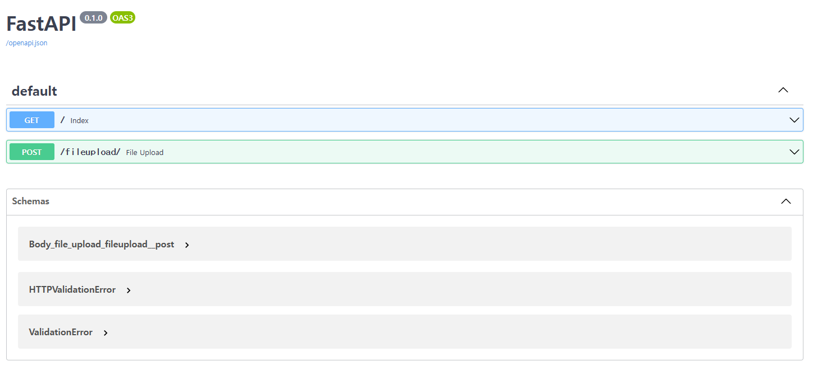

# AzureOpenAI-FastAPI-Sample
Azure OpenAI를 이용하여 파이썬 API를 작성하는 예제입니다. 
- Root에 .env 파일을 추가하여 환경변수를 만들고, Key등 필요한 정보를 설정합니다.(Key정보를 노출하지 않도록 주의하세요.)
```
OPENAI_API_KEY=.........................
OPENAI_API_BASE=https://<base-url>.openai.azure.com/
```
- API실행을 위해서 uvicorn 설치
```
pip install uvicorn
```
- pip install 를 이용하여 필요한 package들 설치합니다.
- .py 파일을 만든후 아래처럼 실행하면 API 실행됩니다.
```
uvicorn <file-name>:app --reload
```
- 브라우저 창에서 아래와 같이 입력하면 API명세를 확인할수 있습니다.
```
http://localhost:8000/docs
```

- FastAPI에서는 여러 템플릿 엔진을 지원하며, 가장 인기 있는 것 중 하나는 Jinja2입니다. Jinja2는 Python에서 매우 인기 있는 템플릿 엔진으로, FastAPI에서도 매우 쉽게 사용할 수 있습니다.
- 먼저, Jinja2를 사용하기 위해 FastAPI에 필요한 패키지를 설치해야 합니다.
```
pip install jinja2
```
- Bootstrap 
